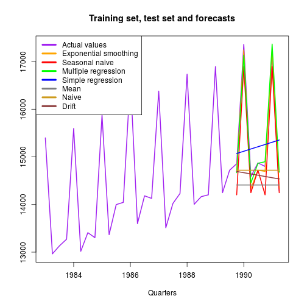
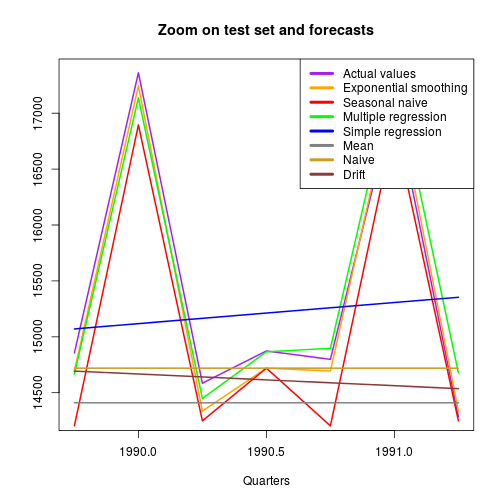

Forecasting
========================================================
author: Joel Le Lay
date: 2016/04/08
transition: linear 

========================================================  

The app Forecasting displays on the same plot the forecasts made by 7 different methods once you have selected a time series  from a drop-down list, then a period to forecast (test set)  
and a period used to forecast (training set) (these are consecutive) through 3 sliders.  
Four methods, namely Mean, Naive, Drift and Seasonal naive are simple methods used as benchmarks.  
Thus, the other three Exponential smoothing, Multiple regression and Simple regression are compared to these so as to see whether they are doing better or not.   
If you choose the time series [retail_turnover][1], a test set from  1989.75 to 1991.5, and a training set starting from  1983, then you will get, under the tabs FORECASTS and ZOOM:  
[1]:https://datamarket.com/data/set/22n7/quarterly-retail-turnover-m-current-jun-1982-dec-1991#!ds=22n7&display=line  

Plots
========================================================

 
All chunks codes are in [GitHub][2]  
[2]:http://github.com/lelayj/DATAPRODUCT  
***
 
and in the app at PITCH

=============================================
under the tab ACCURACY (MAPE = Mean Abs. Perc. Error):                  

|    |Exp_smooth|Seas_naive|Mult_reg|Simp_reg|Mean|Naive|Drift|
|:---|---------:|---------:|-------:|-------:|---:|----:|----:|
|MAPE|       0.9|       2.3|     1.2|       6| 6.2|  5.1|  5.3|
|rank|       1.0|       3.0|     2.0|       6| 7.0|  4.0|  5.0|
 
under the tab TABLE, the Actual values and the Forecasts for the 7 quarters of the test set made by the Top 3 ranked models:           

|                     |    1|    2|    3|    4|    5|    6|    7|
|:--------------------|----:|----:|----:|----:|----:|----:|----:|
|Actual_values        |14856|17362|14585|14874|14798|17115|14285|
|Exponential_Smoothing|14694|17244|14336|14720|14694|17244|14336|
|Multiple_regression  |14668|17137|14449|14866|14897|17367|14678|
|Seasonal_naive       |14204|16895|14248|14720|14204|16895|14248|

================================================  
Nothing beats experiencing different positions of the sliders and different time series, but statistics are nice too! So, given a time series, we considered a lot of different positions for the 3 sliders and were interested for each forecasting method in the percentage of times when it ranked n°1 and in the mean and standard deviation of its MAPE.  
The tab STATISTICS/PLOTS displays the plots showing these results. Here are the results for retail_turnover:  

|             |Exp_Smooth|Seas_naive|Mult_reg|Simp_reg|Mean|Naive|Drift|
|:------------|---------:|---------:|-------:|-------:|---:|----:|----:|
|rank1_percent|      36.8|      25.9|    35.7|     0.3| 3.5|  0.0|  0.0|
|MAPE_mean    |       2.3|       1.9|     1.7|     6.9| 5.2|  8.5|  9.4|
|MAPE_sd      |       2.1|       1.0|     0.8|     1.7| 1.8|  4.6|  5.8|

